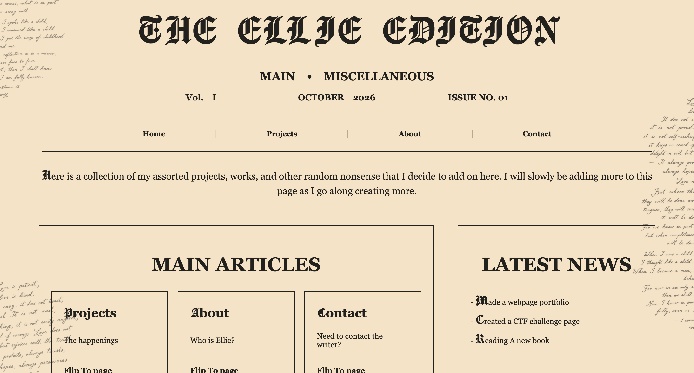

# MY-SITE

The idea behind this was to create a page about me that also acted like 
a portfolio of my projects that I can slowly add to. 

## Demo Link
https://elliewoodward2024-ops.github.io/Portfolio/ 

## Images

## Features

 - A Home Page
 - A Projects Page
  - Includes links to other projects
 - About Me Page

#### References
 - Script Images (pretty-writing.png, pretty-writing2.png, pretty-writing3.png ) through pages have an unknown source but I don't claim as mine.
 

